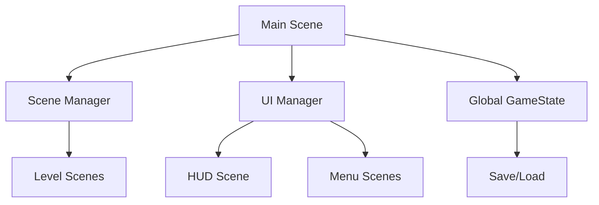
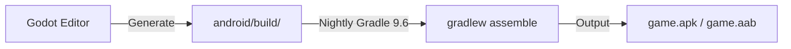

<!-- PRESERVATION RULE: Never delete or replace content. Append or annotate only. -->
# Architecture

## Overview
The game follows a scene-based architecture centered around a `Main` entry point.

## System Structure

## Android Integration
- Leverage Godot's Android plugins for platform-specific features (e.g., Haptics, Billing).
- Responsive UI using Godot's Control nodes (Anchors/Containers).

## Build Pipeline (Custom Android Build)
The project uses the **Custom Android Build** template with a Gradle-based workflow.

- **Gradle Nightly:** `9.6.0-20260328001158+0000`
- **Build Core:** `android/build/build.gradle`
